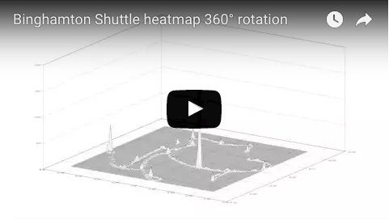
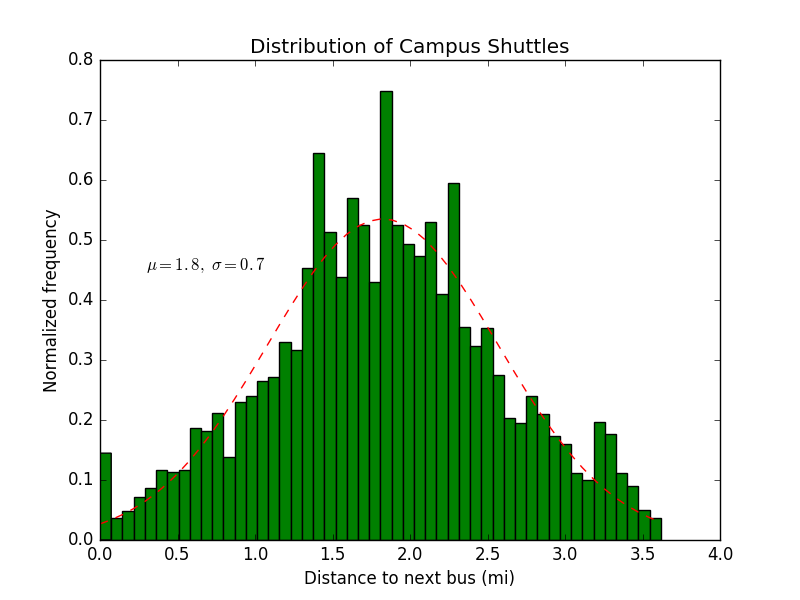
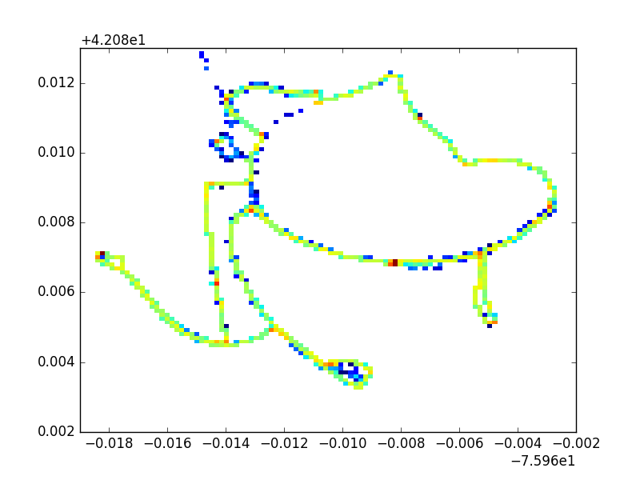

#Analyzing OCCT Bus Data
###Reverse engineered eta spot's app and captured routing and bus location data
Campus shuttles aren't evenly distributed around the route. The distribution below shows approximately how far buses are from each other when two buses are on the road.

The heatmap and 3D visualization below show the most common locations.

