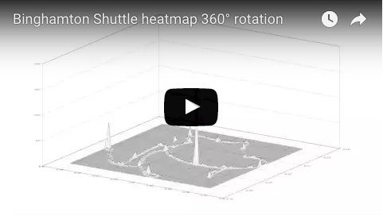
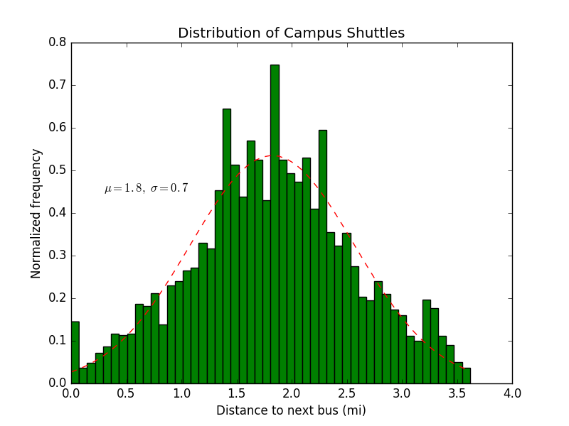
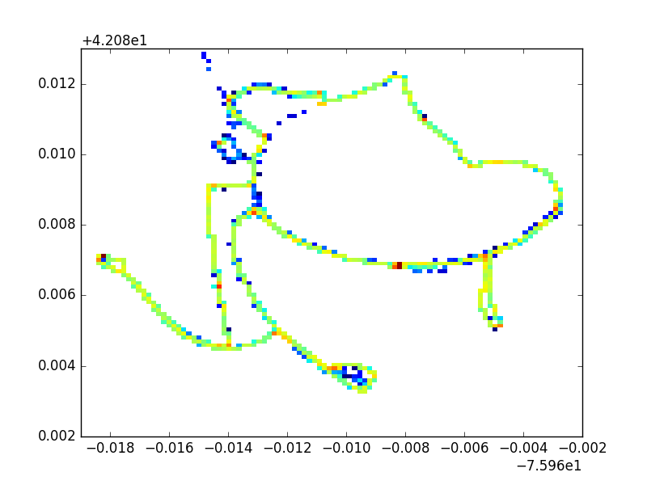

#Analyzing OCCT Bus Data
###Reverse engineered eta spot's app and captured routing and bus location data
Campus shuttles aren't evenly distributed around the route, heatmap of most common locations and 3D vizualization below,

